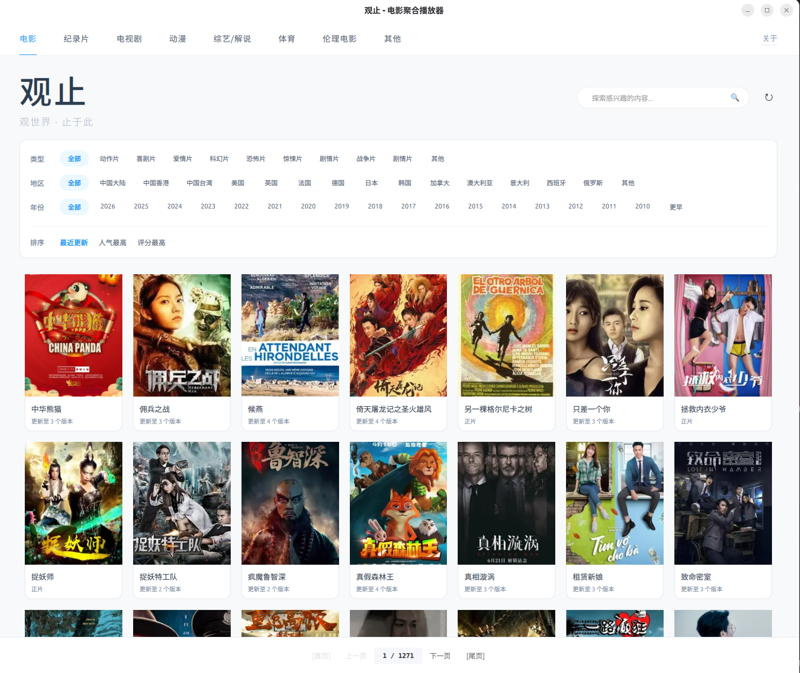
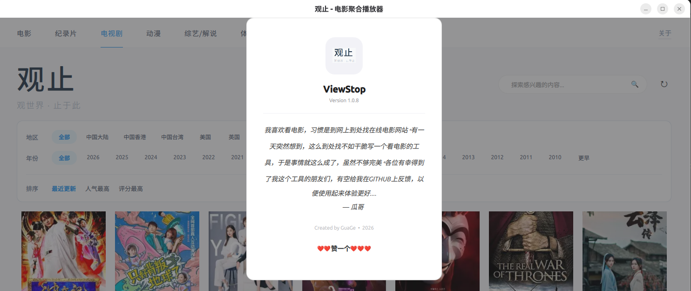

# 观止 (ViewStop) 🎬

**观止** 是一款基于 **PySide6 (Python)** 和 **QML** 构建的高性能桌面影视资源聚合工具。它通过独创的“呼吸式”后台同步引擎，实现全自动资源采集与解析，为用户提供丝滑、纯净的海报墙观影预检体验。
---
> 主界面

> 详情页

> 内置播放器

> 说明

## ✨ 项目亮点

- **呼吸式同步**：后台线程定时轮询，增量采集，既保证数据实时更新，又完全不阻塞 UI 交互。
- **现代 UI 架构**：深度结合 PySide6 的逻辑控制与 QML 的动态渲染，支持海报自适应布局与图片异步加载。
- **持久化存储**：基于 SQLite3 深度优化存储结构，支持数万级影片元数据及多线路播放地址的秒级检索。
- **工业级目录设计**：规范化的项目分层设计，完美解决 Python 跨目录导入难题，方便扩展与测试。

---

## 📂 目录结构

```text
Project_GuanZhi/
├── core/               # 核心层：数据库操作 (database.py)、爬虫逻辑 (spider.py)
├── controllers/        # 逻辑桥梁：PySide6 与 QML 的中枢 (bridge.py)
├── ui/                 # 界面层：QML 视图文件 (Main.qml, Movies.qml)
├── utilities/          # 工具层：后台同步任务 (collector_task.py)
├── tests/              # 测试目录：数据库体检及各项功能测试脚本
├── config.py           # 全局配置：API 接口管理、数据库路径、App 常量
├── app_main.py         # 程序主入口
└── gz.db               # 本地 SQLite 数据库 (自动生成)
```
---

## 🚀 快速开始

### 1. 环境准备

确保已安装 Python 3.8+，执行以下命令安装核心依赖：

```bash
pip install PySide6 requests

```

### 2. 初始化与运行

直接运行主程序，后台引擎将自动根据 config.py 中的配置开始资源同步：

```bash
python app_main.py

```

### 3. 数据体检

若需检查本地数据库的采集状态与数据完整性，可运行测试脚本：

```bash
python tests/test_db.py

```

---

## 🛠️ 技术栈

| 维度 | 技术选型 |
| --- | --- |
| **编程语言** | Python 3.x |
| **GUI 框架** | PySide6 (Qt for Python) |
| **界面描述** | QML (Qt Modeling Language) |
| **数据库** | SQLite3 |
| **网络请求** | Requests |

---

## 📅 开发计划 (TODO)

* [ ] **图片代理**：接入防盗链代理转发，解决部分资源站海报无法显示问题。
* [ ] **智能搜索**：增加顶部实时搜索过滤功能，实现毫秒级搜片。
* [ ] **详情集成**：开发影片详情页，集成内置播放器实现一键解析播放。
* [ ] **多源管理**：支持可视化管理多个资源站源。

---

## 👤 作者

**GuaTuoNewBee** > *观止，让全网影视尽收眼底。*


